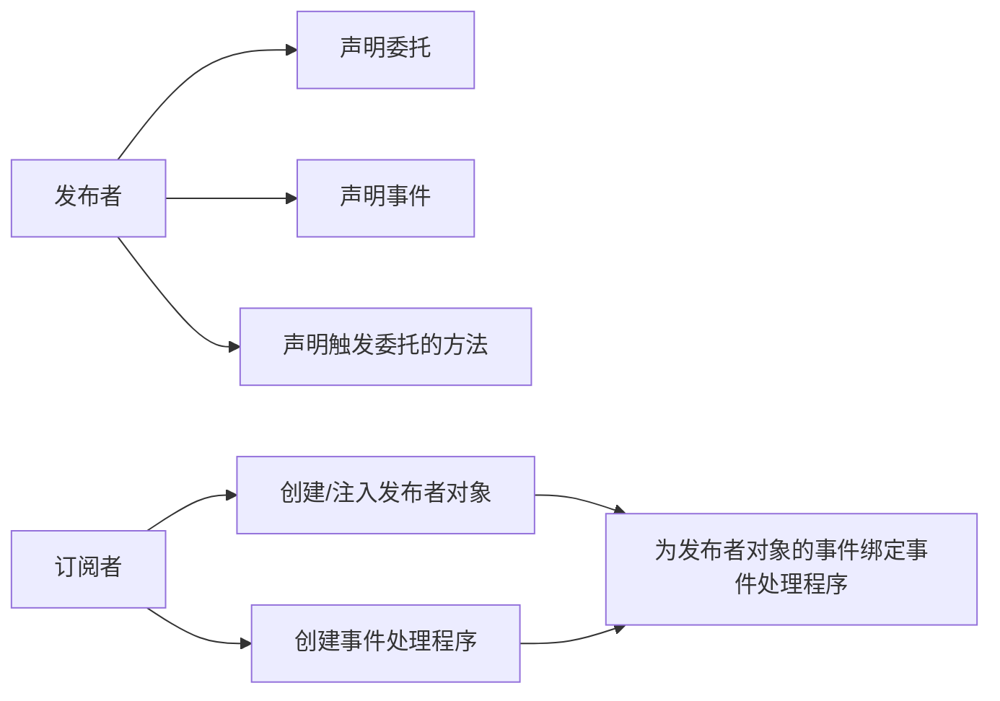

# 常用名词

 - **发布者**：发布某个事件的类/结构
 - **订阅者**：注册方法到发布者事件，并在事件发生时得到通知的类/结构
 - **事件处理程序（回调方法）**：由订阅者注册到事件的方法，并在发布者触发事件时执行。
 - **触发（raise）事件**：调用或触发事件的术语。当事件被触发时，所有注册到它的方法都将会被依次调用。

# 事件的使用流程


# 事件与委托的关系

事件是封装（私有化）的简单委托，事件被触发后，其注册的事件处理程序会依次被执行。

# 事件是成员
事件和方法、属性一样，是类或结构的成员，由此有几个比较重要的特性：
1. 必须声明在类或结构中，且不能在一段可执行代码中声明事件，参考方法的声明；
2. 事件成员被隐式自动初始化为`null`，无需使用new来创建事件对象
 
委托本身就是静态成员(无需添加关键字`static`)，可以定义在类里面，也可以定义在类外面。

# 通过扩展EventArgs来传递数据
使用标准的`EventHandle`委托来声明事件时，有两个必须的参数：`object`类对象和`EventArgs`类对象。
1. `object`类对象用来保存触发事件的对象的引用。
2. `EventArgs`类对象可以用来保存状态信息，指明声明类型适用于该程序。
3. 返回类型是void。
``` CSharp
public delegate void EventHandler(object? sender, EventArgs e);
```
EventArgs类对象声明在System类命名空间中，但是EventArgs不能传递任何数据（所以其通常用于不需要传递参数的事件处理程序）。

如果想要通过第二个参数（EventArgs）传递数据：
1. 必须声明一个派生自EventArgs的自定义类，且声明要传输的数据变量，如：
   ``` CSharp
   public class CountEventArgs:EventArgs
   {
        public int CountNumber{get;set;}
   }
   ```
2. 声明事件时有两种方式:
   方式1——使用泛型委托（泛型类型为自定义类）声明。
   ``` CSharp
   public event EventHandle<CountEventArgs> SimpleCount;
   ```
   方式2——先声明委托（第二个参数为自定义类），再声明事件。
   ``` CSharp
   public delegate void CountEventHandle(object sender,CountEventArgs args);
   public event CountEventHandle SimpleCount;
   ```

# 常见类的说明
`EventArgs`:表示包含事件数据的类的==基类==，并提供用于不包含事件数据的事件的值。
