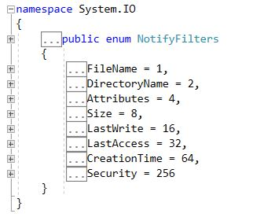

### 功能
类：==FileSystemWatcher== 用于监听指定目录下的文件是否发生变化

### 程序集
`System.IO;`

### 构造方法
``` CSharp
public FileSystemWatcher();
public FileSystemWatcher(string path);
public FileSystemWatcher(string path, string filter);
```
`path`表示被监听文件所在的文件夹，`filter`表示被监听文件夹下指定的监听文件，默认是"*.*"(所有类型的文件)

---
### 属性
==1.Path==
``` CSharp
public string Path { get; set; }
```
监听文件夹，同上`path`

==2.Filter==
``` CSharp
public string Filter { get; set; }
```
文件过滤器，同上`filter`

==3.Filters==
``` CSharp
public Collection<string> Filters { get; }
```
获取当前过滤器的内容,如`*.txt`

==4.NotifyFilter==
``` CSharp
public NotifyFilters NotifyFilter { get; set;}
```
文件属性过滤器，设置被监听文件需要监听的属性,如图:

<div align="center"></div>

`NotifyFilter.FileName`文件名
`NotifyFilter.DirectoryName`文件夹名
`NotifyFilters.Attributes`文件属性（内容？只读属性？）
`NotifyFilters.Size`文件大小
`NotifyFilters.LastWrite`文件最后写入时间
`NotifyFilters.LastAccess`文件最后访问时间
`NotifyFilters.CreationTime`文件创建时间
`NotifyFilters.Security`文件安全性

==5.IncludeSubdirectories==
``` Csharp
public bool IncludeSubdirectories { get; set; }
```
设置子文件夹是否加入监听范围

==6.EnableRaisingEvents==
``` Csharp
public bool EnableRaisingEvents { get; set; }
```
设置监听事件的启动和停止

7.SynchronizingObject ==?==
``` Csharp
public ISynchronizeInvoke SynchronizingObject { get; set; }
```

8.Site ==?==
``` Csharp
public override ISite Site { get; set; }
```

9.InternalBufferSize ==?==
``` Csharp
public int InternalBufferSize { get; set; }
```

---
## 方法

1.Init ==?==
``` Csharp
public void BeginInit();
public void EndInit();
```

==2.WaitForChanged==
``` Csharp
public WaitForChangedResult WaitForChanged(WatcherChangeTypes changeType, int timeout);
public WaitForChangedResult WaitForChanged(WatcherChangeTypes changeType);
```
在当前代码处等待(一直等待或延时`timeout`秒)，指定事件触发一次后继续往下执行

==3.Dispose==
``` CSharp
protected override void Dispose(bool disposing);
```
回收内存

4.其他 ==?==
``` CSharp
protected void OnChanged(FileSystemEventArgs e);
protected void OnCreated(FileSystemEventArgs e);
protected void OnDeleted(FileSystemEventArgs e);
protected void OnError(ErrorEventArgs e);
protected void OnRenamed(RenamedEventArgs e);
```

---
## 事件
``` CSharp
public event ErrorEventHandler Error;
public event FileSystemEventHandler Changed;
public event FileSystemEventHandler Created;
public event FileSystemEventHandler Deleted;
public event RenamedEventHandler Renamed;
```


被监视文件夹的==上一级文件==夹会被占用，无法修改文件名