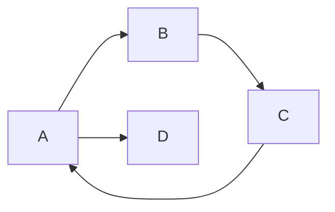

# Hello,World!
## Hello,World!
### Hello,World!
---
**加粗，重点标记&**
*斜体*
~~带删除线的文本~~
空行

==高亮==
风雨彩虹，铿锵==玫瑰==

---

分割线

---

列表：
* 水果名称
    * 西瓜
    * 菠萝
* 蔬菜名称


有序列表：
1. LPL总决赛排名 1
    1. 队伍1
    2. 队伍2
    3. 记住要有空格

可选框的选项
- [ ] 自由泳
- [ ] 砍树
- [x] ==摆烂== 

---

引用文本

> 引用别人说的话
> 我没说过这样的话
> By. 袁隆平
---
这是`行内代码`语法
`adb shell idme print`
`echo|set "/p=<good"`

代码块语法
``` C#
Console.WriteLine();
Console.WriteLine();
```

---
[点击跳转到百度搜索](https:\\www.baidu.com)

网上引用图片：


---
本地引用文件和图片：
[引用本地md文件](.\数据结构介绍.md)

引用本地图片


<div align="center"></div>

---
表格：
|工号|姓名|性别|
|----|----|----|
|F7692596|段勇铭|男|
---
注释：
<!--看不见的注释-->
---
空格：

小空格 $a\,b$
中空格 $a\;b$
大空格 $a\ b$

---
画图：
1.流程图



